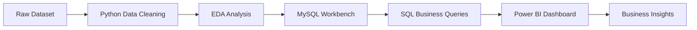

# 🛍️ Customer Behavior Analysis  
### 📊 Python • MySQL Workbench • Power BI

---

# 📌 Project Overview

Customer Behavior Analysis is a complete end-to-end Data Analytics project focused on understanding customer purchasing behavior in the retail/e-commerce domain.

This project uses:

- 🐍 **Python** for Data Cleaning & Exploratory Data Analysis (EDA)
- 🗄️ **MySQL Workbench** for SQL Analysis
- 📊 **Power BI** for Interactive Dashboard Visualization

The goal of this project is to help retail businesses make data-driven decisions to:

✔ Increase Revenue  
✔ Improve Customer Retention  
✔ Optimize Marketing Strategies  
✔ Analyze Product Demand  
✔ Understand Customer Segmentation  
✔ Improve Subscription Programs  

---

# 🎯 Business Problem

Retail companies collect massive amounts of customer transaction data but often fail to convert this raw data into meaningful business insights.

The company wants to answer questions such as:

- Which category generates the highest revenue?
- Do discounts increase purchase value?
- Which customers are loyal or repeat buyers?
- Which age group contributes the most revenue?
- Are subscribed customers spending more?
- Which products perform best and worst?

This project helps solve these problems using Data Analytics and Business Intelligence techniques.

---

## 🔗 Project Links

📊 **Power BI Dashboard:**  
[Click Here to View Power BI Dashboard](https://app.powerbi.com/view?r=eyJrIjoiMjAwMjdiNjQtNWE5Yy00YTg5LWFhMjgtZDRhNjVmNjJmMGE4IiwidCI6ImY5NTNlNDZmLTNmNjUtNGI0Ny1iYWNiLTEyMzg4YWVlMTNlOCJ9)

---

# 🧠 Project Objectives

- Perform Data Cleaning using Python
- Conduct Exploratory Data Analysis (EDA)
- Export cleaned data to MySQL Workbench
- Solve business problems using SQL queries
- Create dynamic Power BI dashboards
- Generate actionable business insights

---

# 🛠️ Tech Stack

| Technology | Purpose |
|---|---|
| Python | Data Cleaning & EDA |
| Pandas | Data Manipulation |
| NumPy | Numerical Computation |
| Matplotlib | Data Visualization |
| Seaborn | Statistical Visualization |
| MySQL Workbench | SQL Analysis |
| Power BI | Dashboard & Reporting |

---

# 📂 Dataset Information

### Dataset Type
Retail / E-commerce Dataset

### Dataset Nature
Structured Tabular Dataset

### Data Level
Customer Transaction Level

---

# 📑 Dataset Features

| Column Name | Description |
|---|---|
| Customer ID | Unique customer identifier |
| Age | Customer age |
| Gender | Male/Female/Other |
| Item Purchased | Product purchased |
| Category | Product category |
| Purchase Amount | Amount spent |
| Season | Purchase season |
| Review Rating | Product rating |
| Subscription Status | Subscription membership |
| Shipping Type | Delivery method |
| Discount Applied | Discount usage |
| Previous Purchases | Past purchase count |
| Payment Method | Payment mode |

---

# 🔄 Project Workflow

---

# 🧹 Data Cleaning Process (Python)

The dataset contained:
- Missing values
- Inconsistent categories
- Duplicate records
- Improper column naming

### Cleaning Steps Performed

✔ Missing Value Handling  
✔ Duplicate Removal  
✔ Category Mapping Correction  
✔ Column Standardization  
✔ Data Type Conversion  
✔ Feature Cleaning  

---

# 📊 Exploratory Data Analysis (EDA)

EDA was performed to understand:

- Customer spending behavior
- Product demand trends
- Revenue distribution
- Discount impact
- Customer demographics
- Shipping preferences
- Subscription analysis

---

# 🗄️ MySQL Workbench Analysis

After cleaning the data using Python, the processed dataset was exported into **MySQL Workbench** for SQL analysis.

### SQL Analysis Included:

- Revenue Analysis
- Customer Segmentation
- Discount Analysis
- Product Performance
- Age Group Contribution
- Subscription Analysis

---

# 📊 Power BI Dashboard

The Power BI dashboard provides interactive visual insights into:
- Analyze customer purchasing patterns and spending behavior.
- Identify the product categories generating the highest revenue.
- Evaluate the effectiveness of discounts on purchase value.
- Compare spending behavior between male and female customers.
- Identify customers who used discounts but still spent above-average amounts. 

The Power BI dashboard provides interactive visual insights into:
-  Compare purchase values between Standard and Express shipping methods.
- Understand the impact of customer subscriptions on revenue generation.
- Identify products with the highest discount usage percentage.
- Segment customers into New, Returning, and Loyal categories.
- Analyze whether repeat buyers are more likely to subscribe.

---

# 📌 Dashboard KPIs

| KPI | Value |
|---|---|
| Total Customers | 5000 |
| Unique Products | 30 |
| Total Revenue | 994K |
| Average Spend | 198 |
| Average Rating | 3.62 |

---

# 📚 Learning Outcomes

Through this project, I learned:

- Real-world data cleaning techniques
- Advanced Exploratory Data Analysis
- SQL query optimization
- Data storytelling with Power BI
- Business intelligence reporting
- Customer segmentation strategies

---

# ⭐ Conclusion

This project successfully demonstrates how Data Analytics can help retail businesses understand customer behavior and improve business decision-making.

Using Python, MySQL Workbench, and Power BI, meaningful business insights were generated related to:

- Revenue optimization
- Customer retention
- Product demand
- Subscription behavior
- Discount effectiveness

This project showcases the complete Data Analytics lifecycle from raw data to actionable insights.

---

# 🌟 Support

If you found this project useful:

⭐ Star this repository  
🍴 Fork this repository  
📢 Share with others  

---

### © Made with ❤️ by Dilshan . All Rights Reserved 2026
